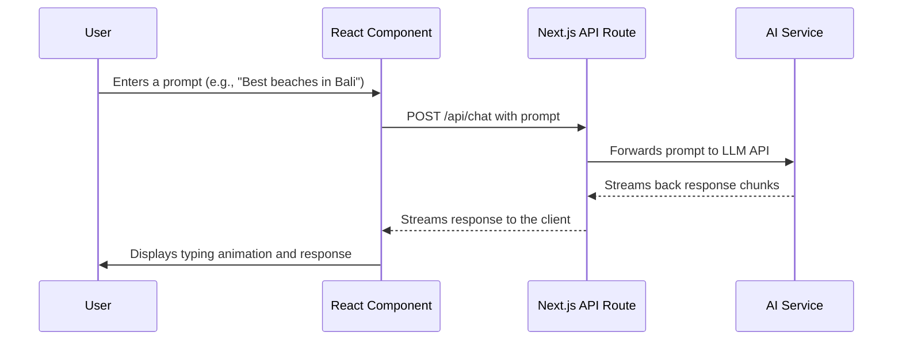
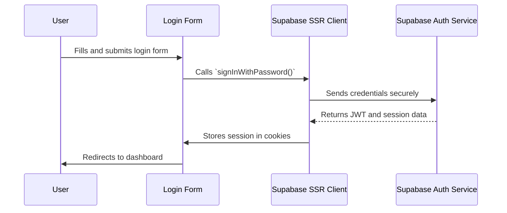
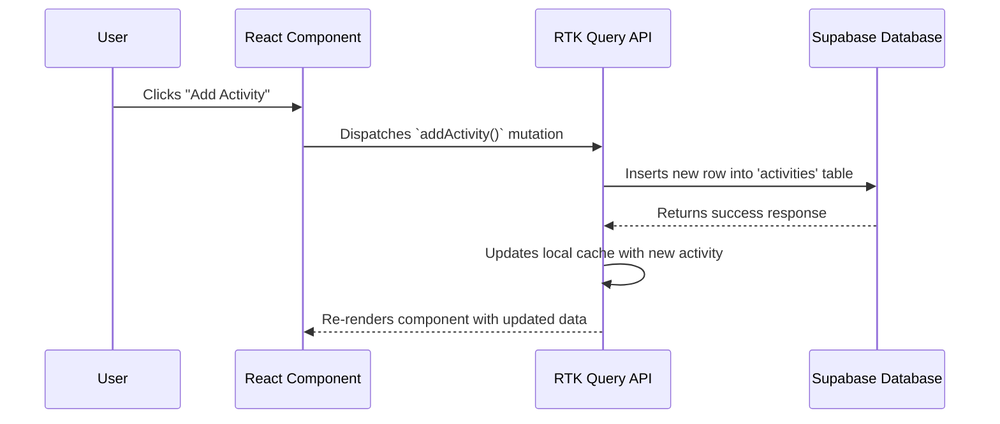
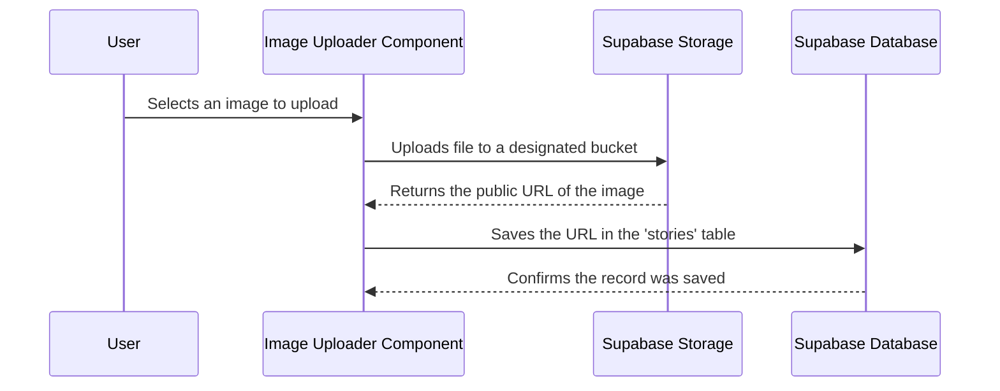
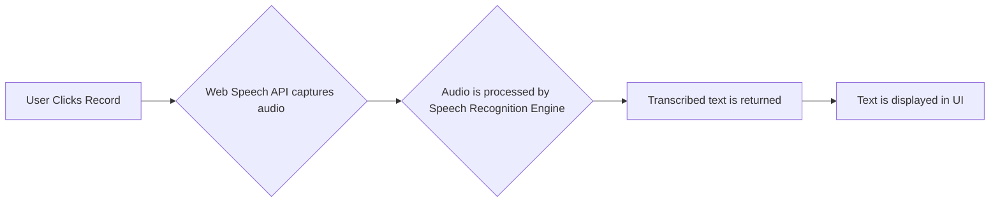
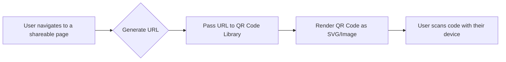
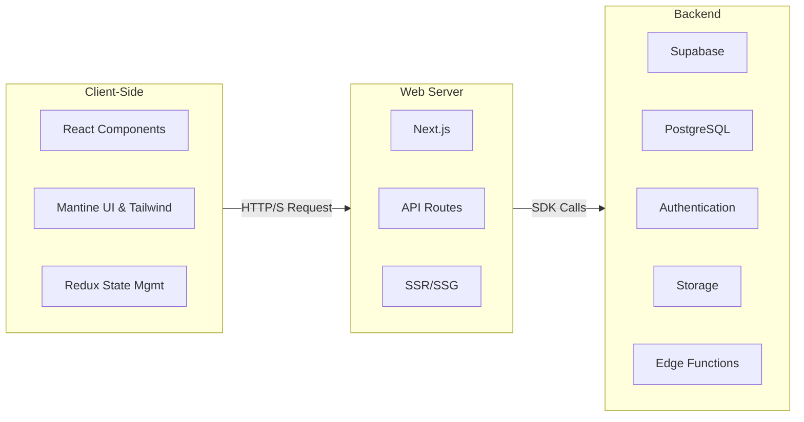
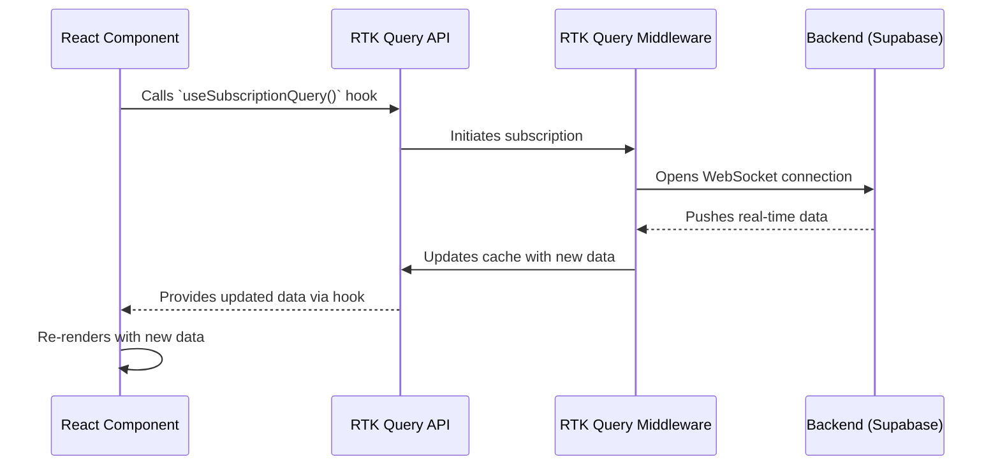

# Travel Buddy ✈️

Travel Buddy is a modern, AI-powered web application designed to make trip planning seamless and enjoyable. It leverages AI to provide personalized travel recommendations, helps you organize your itinerary, and allows you to capture and share your travel stories with ease.

## ✨ Features Deep Dive

This section provides a technical overview of the key features of the Travel Buddy application.

- [🤖 AI-Powered Chatbot](#ai-powered-chatbot)
- [🔐 Secure Authentication](#secure-authentication)
- [📝 Itinerary & Story Management](#-itinerary--story-management)
- [📸 Image & Media Handling](#-image--media-handling)
- [🎤 Voice-to-Text](#-voice-to-text)
- [🤳 QR Code Sharing](#-qr-code-sharing)

### AI-Powered Chatbot

The chatbot provides users with personalized travel recommendations by leveraging a Large Language Model (LLM). User prompts are sent to a dedicated Next.js API route, which securely communicates with the LLM. Responses are streamed back to the client to create a real-time, interactive experience.



### Secure Authentication

User authentication is handled by Supabase Auth, which provides a secure and scalable solution for managing user accounts, including sign-up, sign-in, and session management. The `@supabase/ssr` library is used to seamlessly manage user sessions across both client-side and server-side rendering contexts.



### 📝 Itinerary & Story Management

Users can create, manage, and share their travel itineraries and stories. This functionality is powered by a combination of RTK Query for state management and Supabase for the backend. Data is fetched and cached on the client, and mutations (create, update, delete) are sent to the Supabase database.



#### RTK Query & Data Fetching Strategy

The application employs a hybrid data fetching strategy:

1.  **Client-Side**: **RTK Query** is used for managing client-side state, caching, and real-time updates from Supabase.
2.  **Server-Side**: For Server Components, dedicated functions in `src/lib/server-api/` are used to fetch data. These functions mirror the client-side RTK Query hooks and call external API endpoints.

This approach ensures a consistent data structure across the application while leveraging the benefits of both client-side caching and server-side rendering.

Here is a breakdown of the key data fetching slices and their corresponding server-side logic:

| RTK Query Slice (Client) | Server-Side Function (`src/lib/server-api/`) | External API Endpoint Called                                         |
| ------------------------ | -------------------------------------------- | -------------------------------------------------------------------- |
| `storyApi` (get all)     | `getAllPublishedStories()`                   | `https://fork-travel-buddy.vercel.app/api/v1/story/public`           |
| `storyApi` (get single)  | `getSinglePublishedStory()`                  | `https://fork-travel-buddy.vercel.app/api/v1/story/public?story-id=` |
| `storyApi` (upload)      | `uploadStoryAgent()`                         | `https://travelbuddy-agents-server.../api/v1/story`                  |

### 📸 Image & Media Handling

For features like Story Creation, users can upload images and other media. These files are uploaded directly from the client to Supabase Storage using a secure, token-based access system. The URL of the uploaded media is then stored in the corresponding database record (e.g., in the `stories` table).



### 🎤 Voice-to-Text

The voice-to-text feature uses the browser's built-in Web Speech API to capture audio from the user's microphone. This audio is then processed by a speech recognition service, which transcribes it into text. This feature allows for hands-free note-taking and interaction.



### 🤳 QR Code Sharing

Users can easily share their profiles or travel plans via QR codes. The application generates these codes on the client-side using a lightweight library. The QR code encodes a unique URL that leads directly to the user's shared content.



## 🔗 API Endpoints & Services

The application's backend is composed of multiple services, each with a distinct role. This multi-host architecture allows for a separation of concerns, where core database operations are handled by Supabase, and specialized tasks are delegated to dedicated serverless environments.

### 1. Supabase API

- **Host**: Your Supabase project URL (from `NEXT_PUBLIC_SUPABASE_URL`).
- **Purpose**: This is the primary backend for core business logic. It handles all standard CRUD (Create, Read, Update, Delete) operations directly against the PostgreSQL database. The Supabase client SDK is used for secure and straightforward communication.

### 2. Vercel API

- **Host**: `https://fork-travel-buddy.vercel.app`
- **Purpose**: This API serves public-facing data. It's used for endpoints that need to be accessed without authentication, such as fetching published stories or other shared content. It acts as a public gateway to a subset of the application's data.

### 3. Agent Server API

- **Host**: `https://travelbuddy-agents-server-....run.app`
- **Purpose**: This is a specialized service for handling complex, agent-related tasks. Its responsibilities include processing media uploads, managing streaming data, and executing other AI-driven or long-running jobs that are best handled outside the main application server.

## 🏗️ Architecture Diagram

The application follows a modern, component-based architecture using Next.js for the frontend and Supabase as the backend-as-a-service (BaaS).



## 🌊 Real-time Data Flow with RTK

The application uses Redux Toolkit (RTK) Query to manage real-time data streams from services like Supabase Realtime. This allows for an efficient, scalable, and maintainable approach to handling live data updates within React components.

Here is a diagram illustrating the flow:



## 🛠️ Technology Stack

This project is built with a modern and robust technology stack:

- **Framework**: [Next.js](https://nextjs.org/) 15.x
- **Language**: [TypeScript](https://www.typescriptlang.org/)
- **UI Library**: [Mantine UI](https://mantine.dev/) & [Tailwind CSS](https://tailwindcss.com/)
- **State Management**: [Redux Toolkit](https://redux-toolkit.js.org/)
- **Backend & Database**: [Supabase](https://supabase.io/)
- **Form Handling**: [React Hook Form](https://react-hook-form.com/)
- **Styling**: [Framer Motion](https://www.framer.com/motion/) for animations
- **Linting & Formatting**: ESLint & Prettier
- **Package Manager**: [pnpm](https://pnpm.io/)

## 🚀 Getting Started

Follow these steps to get the development environment up and running.

### Prerequisites

Make sure you have Node.js (v18 or newer) and pnpm installed.

```bash
# Enable Corepack to manage pnpm (comes with Node.js)
corepack enable
```

### 1. Clone the Repository

```bash
git clone https://github.com/your-username/travel-buddy-fe.git
cd travel-buddy-fe
```

### 2. Install Dependencies

```bash
pnpm install
```

### 3. Set Up Environment Variables

Create a `.env.local` file in the root of the project and add your Supabase credentials:

```
NEXT_PUBLIC_SUPABASE_URL=your-supabase-url
NEXT_PUBLIC_SUPABASE_ANON_KEY=your-supabase-anon-key
```

### 4. Run the Development Server

```bash
pnpm dev
```

Open [http://localhost:3000](http://localhost:3000) in your browser to see the result.

## 📦 Available Scripts

- `pnpm dev`: Starts the development server.
- `pnpm build`: Creates a production-ready build.
- `pnpm start`: Starts the production server.
- `pnpm lint`: Lints the code for errors.
- `pnpm format`: Formats all files using Prettier.

## 📄 License

This project is licensed under the MIT License.
